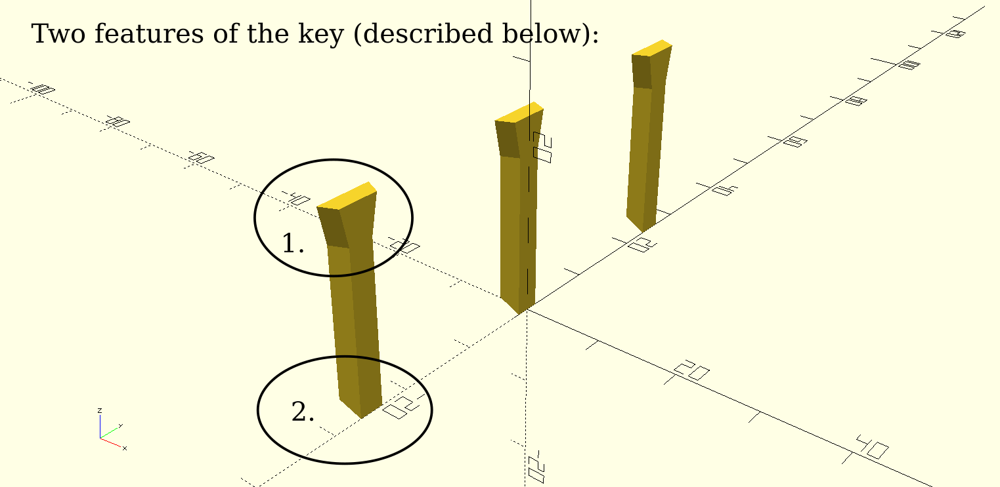

= Modular TableClip System

Do you have table so cluttered you don't see the color of the desk? TableClip to the rescue! ;)

Jokes aside, some time ago I've got inspired by the https://www.thingiverse.com/thing:2892387[USB Cable Organizer] and thought that this could be extended to other useful things and also improved.

So I designed modular system that is divided to parts. The table clip itsef and various modules that can be attached to the clip through lock mechanism.

.Available modules
* cable holder
* pen and paper holder
* headphones holder

For the ready-to-print `stl` files, go to https://www.prusaprinters.org/prints/57023-modular-tableclip-system-with-sources[TableClip on prusaprinters.org]

*BUT* the best thing about it is that I'm sharing the sources here. So everybody can design his own modules that can be attached to the base module.

== Designing own modules

If you do not want to design new modules in the OpenSCAD, you can use just the key object (`_key.stl`) and add it to anything you design in program of your choice. The key and the lock themselves are designed in a way that allows for two things:

. It is not necessary to print the key in the full height. The connected module still stays on top (see headphones holder for example).
. Key does not have to be printed from the bed, it is fully capable of printing in the middle of the print. The modules themselves can therefore extend below the table (see pencil holder for example).

== Dependencies
* threadlib - https://github.com/adrianschlatter/threadlib
** dependencies of the threadlib (follow the instructions on their page, it's just copying files over)
** scad-utils - https://github.com/openscad/scad-utils
** list-comprehension - https://github.com/openscad/list-comprehension-demos
** thread_profile.scad - https://github.com/MisterHW/IoP-satellite/blob/master/OpenSCAD%20bottle%20threads/thread_profile.scad
* Round-Anything - https://github.com/Irev-Dev/Round-Anything
